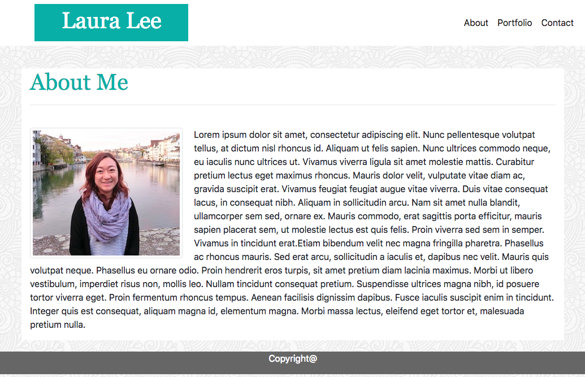
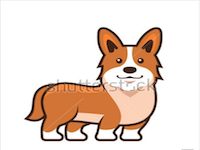

# Bootstrap-Portfolio
Assignment_Bootstrap-Portfolio

# Link to deployed site
https://lalatw.github.io/Bootstrap-Portfolio/


# Images
 

# Technology used
* html
* css
* Bootstrap


# Code snippets


```
        <div class="card-deck photoRow">
            <div class="card">
                
                <div class="card-body projectName">
                    <h5 class="card-title">Project 3</h5>
                </div>
            </div>
    
            <div class="card">
                
                <div class="card-body projectName">
                    <h5 class="card-title">Project 4</h5>
                </div>
            </div>
    
            <div class="col"></div>
        </div>
    


```


# Learning points
* Use Bootstrap to apply HTML and CSS design templates.
* Use grid to create layout.
* Use component Navbar to creat Navbar on the top.
* Use component Card for groups of images and text.
* Use component Forms for input style.
 


# Author 
[Shuhan Laura Lee](https://lalatw.github.io/Bootstrap-Portfolio/)


# License
Standard MIT License
